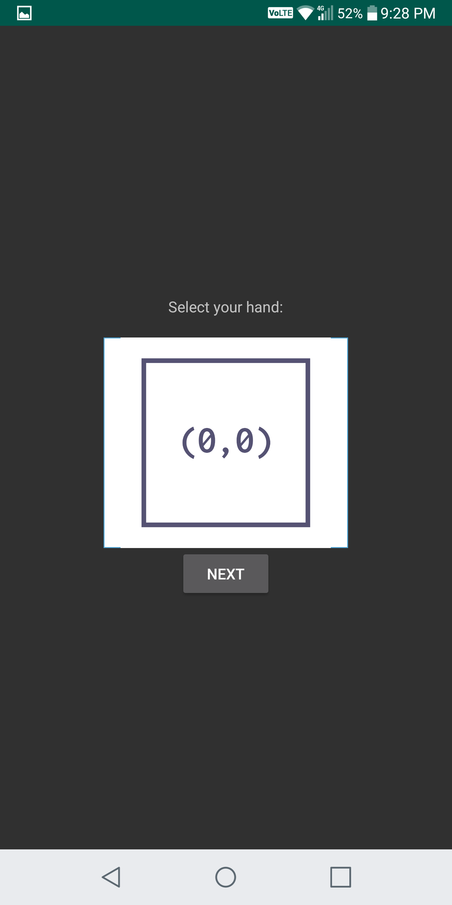
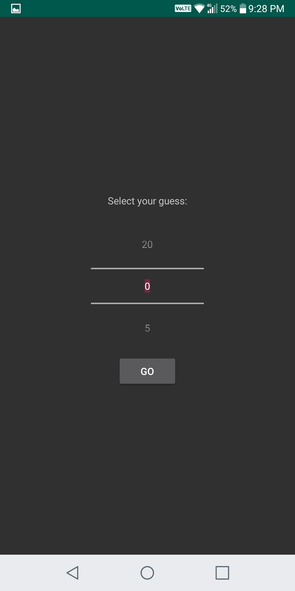

# Chinese_Drinking_Games_15_20

An Android application written by Java in Android Studio
 
Rule of the game 15-20

1. Players extend both hands and reveal either a closed fist (representing a value of 0) or open hand (value of 5) at the same time, much like you would in a game of rock, paper, scissors. However, at the moment the hands are deployed, the player calls out their prediction of the total value of both hands, which could be 0, 5, or 10. 

2. If the player guesses correctly, he gets to call again, at which point every player has the option of changing their hands. If the player guesses incorrectly, the call goes to the next in line. 

3. The game ends when one player manages two consecutive correct guesses.

Functions

A. Gaming
1.  When the player start the game for the first time, the app will redirct the player to do the registration first, which store player’s name, date of birth, phone number and email by using shared preferences in player's phone. Moreover, he can update his personal information in the app.

  

2.	The game will show (0,0),(0,5),(5,0),(5,5) to represent player's two hands to let him to choose. Next screen will show 0,5,10,15,20 on the screen for him to guess the number.

  
  

3. Once he makes his guess and hands, the app will get the hands and guess (useless at this round) of your opponent from the server. On the screen, the app should show the name of your opponent, the hands of the player and corresponding opponent. The game will show the player win the game if the number on the screen is same as the player guess. 

  
  
  

   Otherwise, the game will go on next round but this time he only selects his hands, i.e. (0,0),(0,5),(5,0),(5,5) and then the app will get the hands and guess of your opponent from the server again and go on. The game will go on until the number on the screen will be same as your guess or opponent's guess.

4. If the game gets the winner, the player can touch a Continue button to play again or Quit button to leave it.

  

B. Update player's information
1. The player can update his information

C. Statistics

1. Show statistics of past game, which use canvas to draw chart and get data from database

 

D. Other

1. The information of opponent will be delivery as JSON string.

2. The game log is store in local database, which in the devices.
